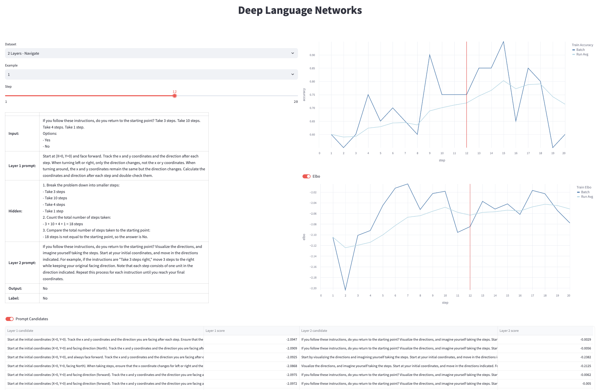

# Deep Language Networks Demo




## Install dependencies
From the demo directory, run the following command to install the additional dependencies:

```
pip install -r requirements.txt
```

## Generate plot for the given data.json file

```
streamlit run demo.py
```

## Visualizing your own results
1. Please see the [Variational Inference README](projects/vi_dln/README.md) for information on how to run experiments.

   Your results will be stored in the log directory by default (projects/vi_dln/log/result_data.json).

   Alternatively, you can specify the output directory using the --result_data_path argument.

2. Run the demo.py file to generate the plot for your results.

   ```
   streamlit run demo.py <result_data_path>/result_data.json
   ```

   You can load multiple result_data.json files by specifying multiple paths.

   ```
   streamlit run demo.py <result_data_path_1>/result_data.json <result_data_path_2>/result_data.json
   ```

## Serving from Docker
Run the following commands to serve the demo from a Docker container:
```
docker build -t dln-demo .
docker run --name dln-demo --restart unless-stopped -d -p 8001:8501 dln-demo
```
Open your browser and navigate to http://localhost:8001.
